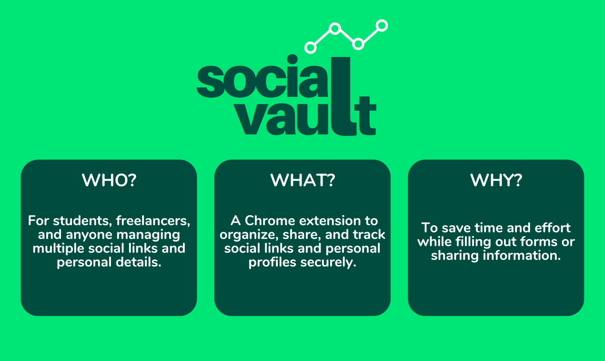
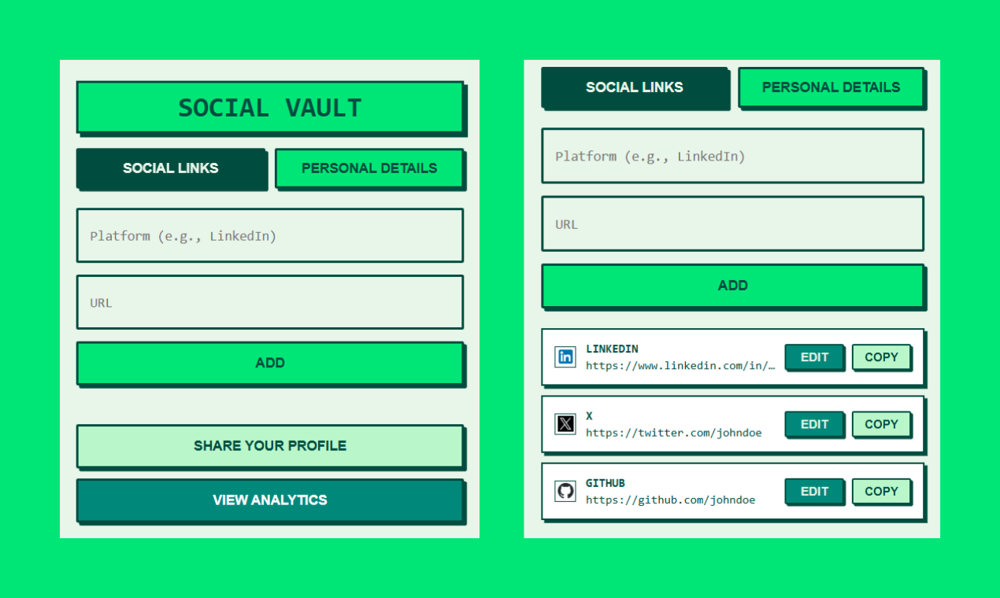
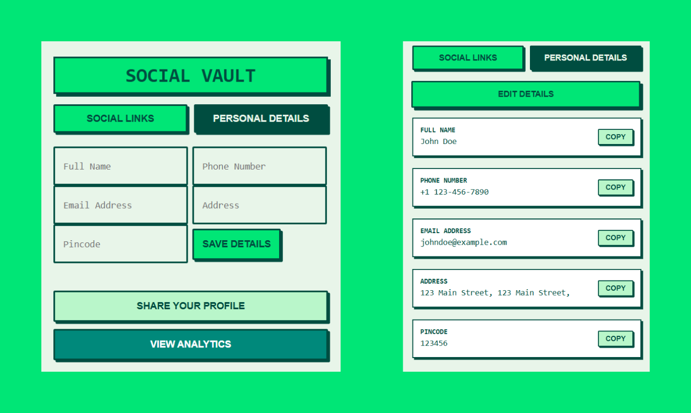
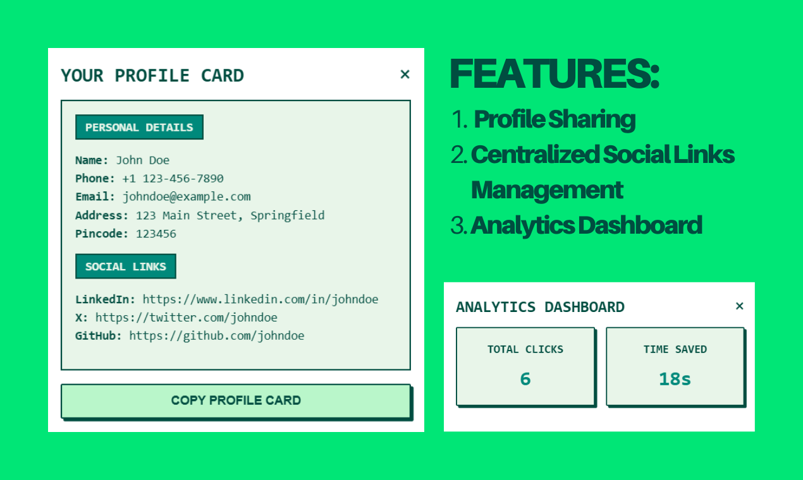

# Social Vault

Social Vault is a Chrome extension designed to manage and share your social links and personal details efficiently. With its user-friendly interface, it allows you to securely store and share your information in a dynamic profile card, directly from your browser.

## Product Images

## Features

- **Social Links Manager**: Add, view, and manage your social media links easily.
- **Personal Details Section**: Store personal information like name, phone number, email, address, and pincode.
- **Profile Sharing**: Generate a dynamic profile card to share your information.
- **Analytics Dashboard**: Track total clicks and time saved using your profile.

## How to Install

1. Download the extension's source code.
2. Open Chrome and navigate to `chrome://extensions/`.
3. Enable "Developer mode" in the top-right corner.
4. Click on the "Load unpacked" button.
5. Select the folder containing the extension's source files.
6. The extension will appear in your toolbar, ready to use.

## Usage

1. **Adding Social Links**:

   - Enter the platform name (e.g., LinkedIn) and the URL.
   - Click "Add" to save the link.

2. **Storing Personal Details**:

   - Fill in the form with your personal details.
   - Click "Save Details" to store the information.

3. **Profile Sharing**:

   - Click "Share Your Profile" to generate a dynamic profile card.
   - Copy the profile card to share it with others.

4. **Viewing Analytics**:

   - Click "View Analytics" to see the total clicks and time saved using your profile.

## Contributing

Contributions are welcome! Feel free to submit issues or pull requests to enhance the functionality of Social Vault.

## Support

If you find this project useful, please consider starring the repository to show your support!

## License

This project is licensed under the [MIT License](LICENSE).

