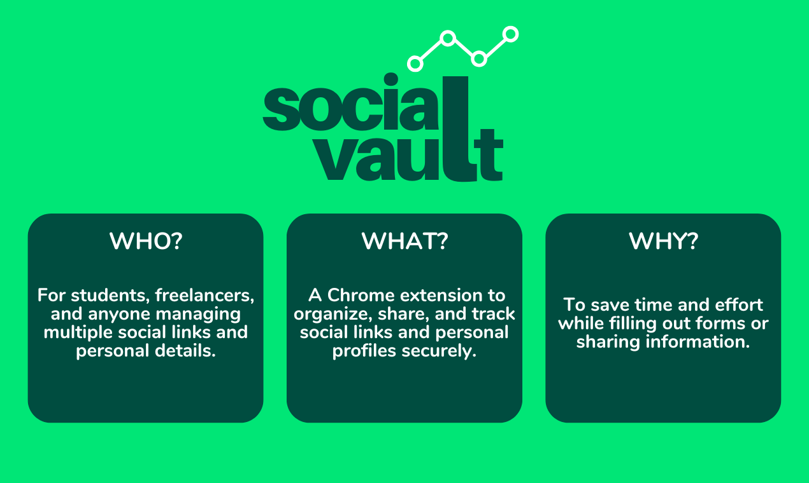
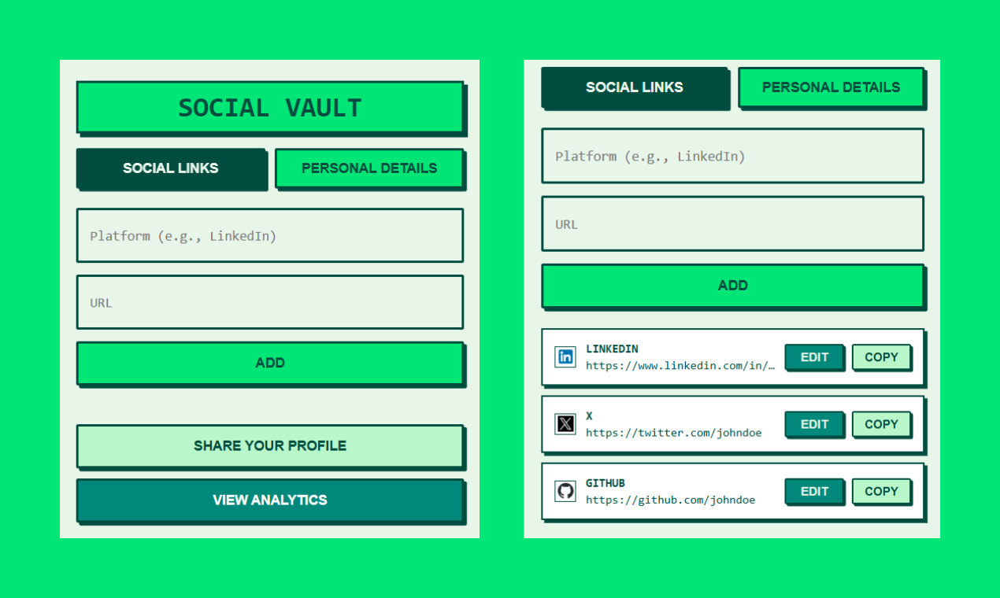
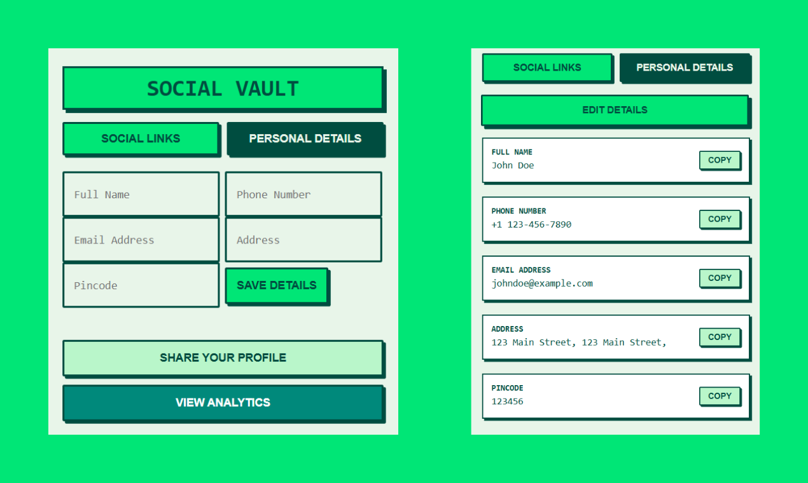
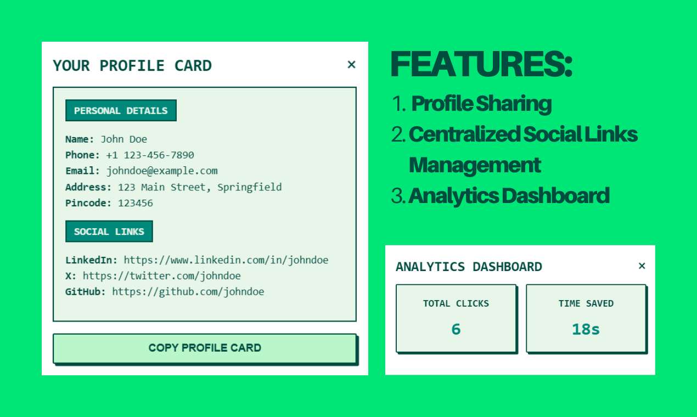

# Social Vault

Save your social links and contact details once. Then copy them with one click, or right-click any form field to paste a saved value.

Social Vault is a Manifest V3 Chrome extension. All data lives in Chrome's encrypted sync storage — nothing is ever sent to a server.






## Features

- **Right-click to paste** — right-click any form field and pick a saved value from the **Social Vault** menu. Works on framework-driven inputs (React, Vue) by dispatching native events.
- **Multiple profiles** — keep Work and Personal separate. Switch profiles from the popup header.
- **One-click copy** — copy any link or contact field to the clipboard with the green Copy button.
- **Inline detail editing** — click Edit details and update each field in place.
- **Shareable profile card** — generate a text card combining all your details and links.
- **Sync across devices** — backed by `chrome.storage.sync`, your data follows your Google account into any Chrome where you're signed in.
- **JSON import / export** — full backup and restore from Settings.
- **Light, dark, and system themes**.
- **Local usage analytics** — see how many copies you've done and how much time you've saved.
- **Keyboard shortcut** — `Cmd/Ctrl + Shift + L` opens the popup.

## Install (developer mode)

1. Clone or download this repo.
2. Open `chrome://extensions/`.
3. Toggle **Developer mode** on (top-right).
4. Click **Load unpacked** and select this folder.
5. Pin the Social Vault icon to your toolbar.

Video walkthrough: <https://www.youtube.com/watch?v=kanIAQYImhY>

## How to use

1. **Add data.** Open the popup. Add your social links under **Links**. Under **Details**, click **Edit details** and fill the inline inputs, then **Save**.
2. **Paste into a form.** Right-click any input on a page and choose **Social Vault → \<value\>** to paste it.
3. **Copy a value.** Click **Copy** next to any link or detail in the popup.
4. **Share your profile.** Click **Share profile** to copy a formatted card.
5. **Manage profiles.** Open the gear icon → add, rename, or delete profiles; switch the active profile from the header dropdown.
6. **Back up.** Settings → **Export JSON**. Restore with **Import JSON** (merge or replace).

## File layout

```
manifest.json     MV3 manifest, permissions, commands
popup.html        Popup UI
popup.js          UI logic
style.css         Modern light/dark theme
storage.js        chrome.storage.sync wrapper + migration
background.js    Service worker — builds the right-click "Social Vault" menu
content.js        Injected on demand by the right-click menu to paste into the focused field
icon{16,32,48,128}.png   Toolbar/store icons
assets/          Screenshots, logo, fallback favicon
PRIVACY.md        Privacy policy (link from the Web Store listing)
STORE_LISTING.md  Copy + permission justifications for the store submission
```

## Privacy

Social Vault does **not** transmit your data anywhere. See [PRIVACY.md](PRIVACY.md) for the full policy and a breakdown of every permission the extension requests.

## Roadmap

- Drag-to-reorder links
- Link tagging (Pro / Social / Dev)

## Contributing

Issues and PRs welcome. For UI changes, please include before/after screenshots.

## License

MIT — see source headers.
